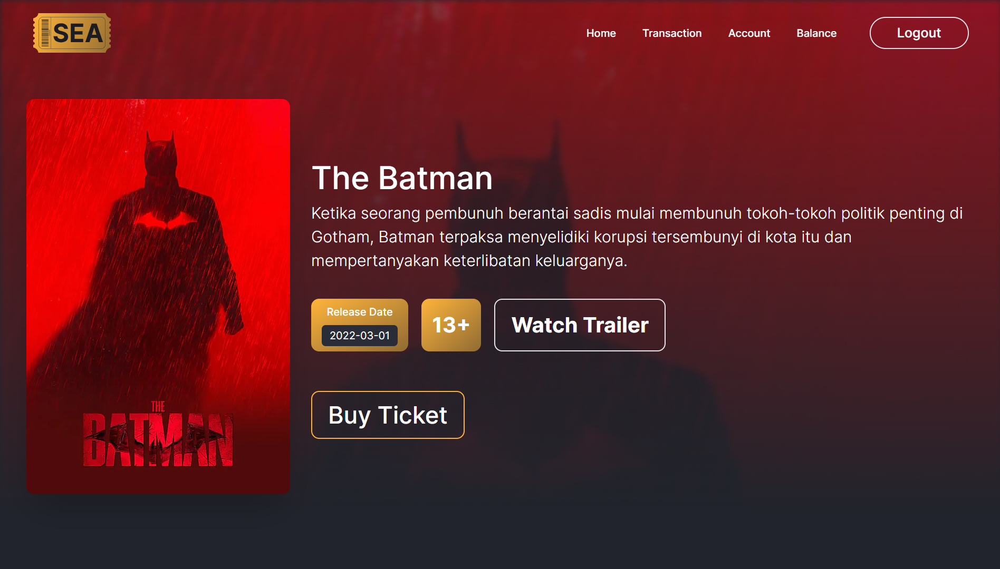
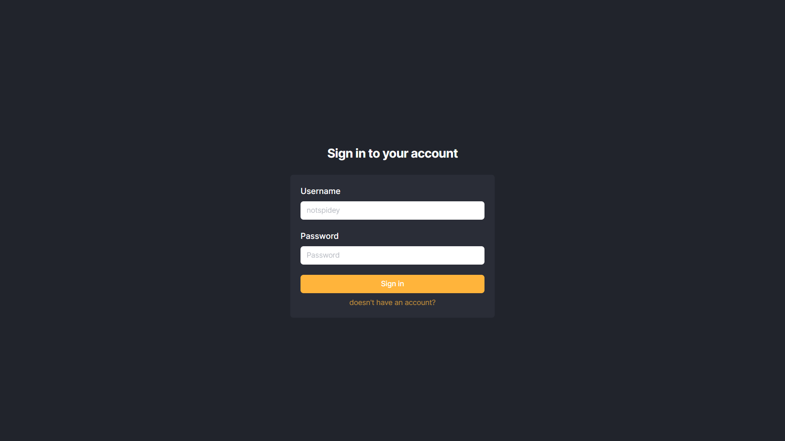
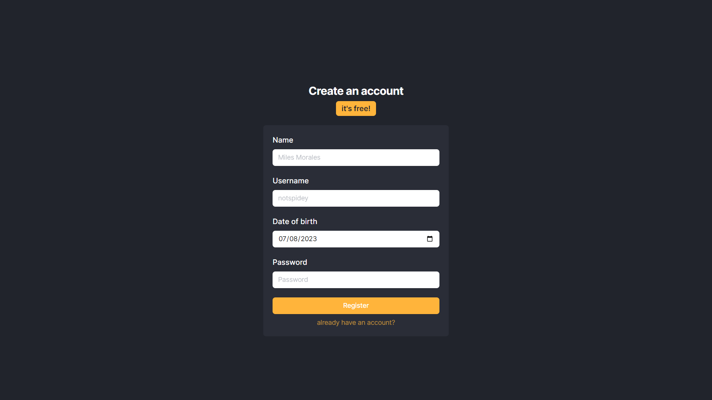
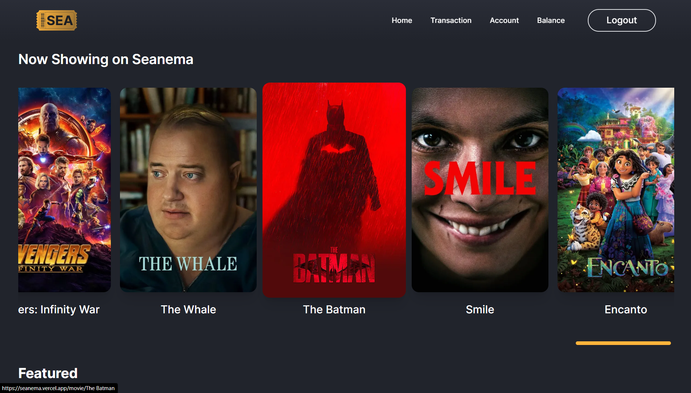
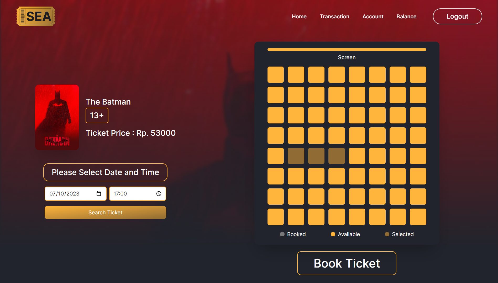
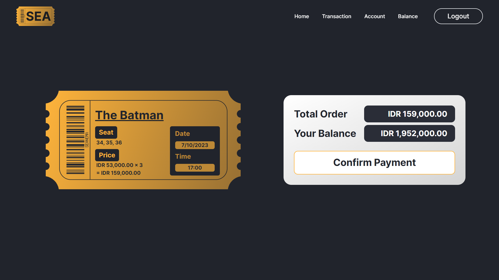
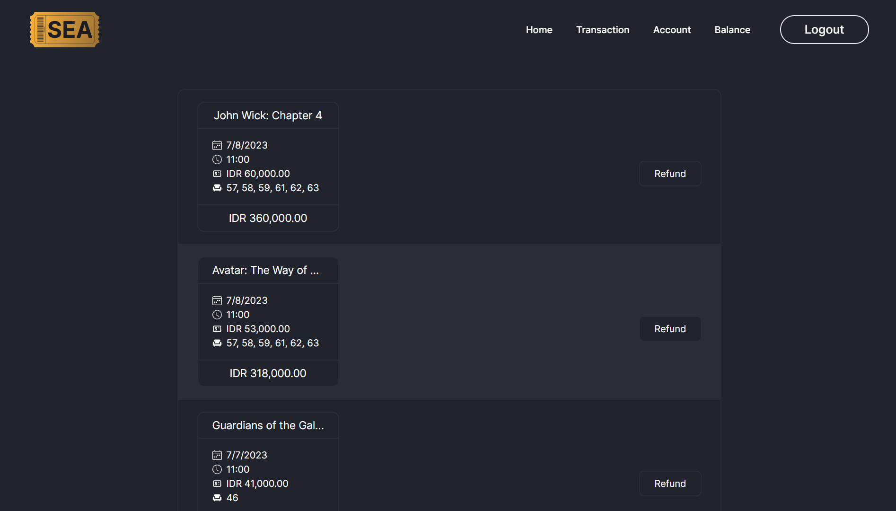
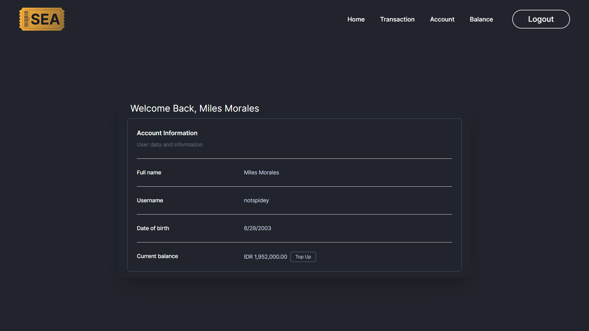
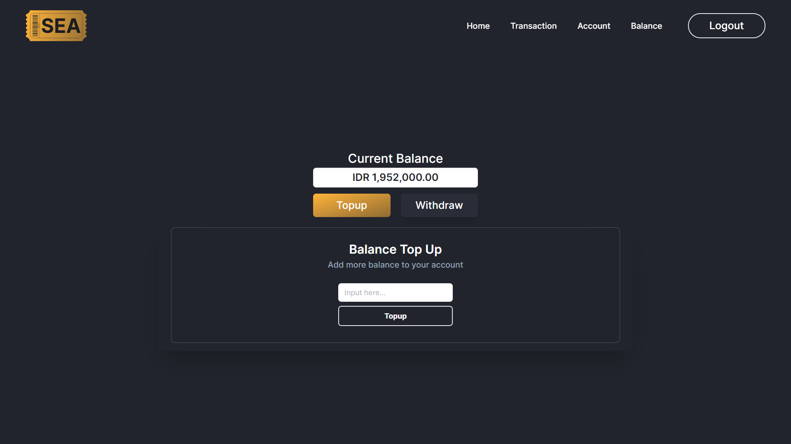

# Seanema | A Brand-New Movie Ticket Booking App

Tired of queueing for a movie ticket? Introducing Seanema, our innovative web app powered by Next.js, TypeScript, Prisma, and MongoDB. With Seanema, say goodbye to long lines and hello to seamless movie ticket booking. Each user enjoys a personalized account with balances and transaction histories, providing ultimate convenience. Browse a wide array of movies, effortlessly book tickets, and even refund them if plans change. Seanema also offers easy top-up and withdrawal options, putting you in complete control. Say hello to hassle-free movie magic with Seanema, your go-to movie ticket booking app.

## Table of Contents

- [Features](#features)
- [Installation](#installation)
- [Usage](#usage)
- [Contributing](#contributing)
- [Contact](#contact)

## Features

- `Discover Movie` Explore a vast selection of movies, view details like title, description, release date, age rating, trailer, and ticket price, all at your fingertips.
- `Personalized Account` Enjoy a customized account with individual balances, credentials, and account information, providing a personalized experience.
- `Book a Movie` Effortlessly book up to 6 tickets per show, and if plans change, easily refund them with a user-friendly interface.
- `Top-up and Withdraw Balance` Take control of your finances by conveniently topping up and withdrawing funds from your account, ensuring a seamless movie-going experience.

## Installation

To install this web app, follow the steps below:

1. Clone this repository or download it as a ZIP file.
2. Navigate to the root folder and create an `.env` file.
3. Open `readme/env.txt` and copy all content inside them to you `.env` file.
4. Open terminal on root folder and run `npm i`.
5. On the same terminal, run `npm run dev`
6. Open https://localhost:3000/ in your web browser.

Alternatively, you can directly use this deployed version of this web app by visiting https://seanema.vercel.app.

## Usage

### Login & Register

### Browse Movie

### Ticket Booking & Payment

### Transaction, Account & Balance

## Contributing

Mohammad Farhan Fahrezy

## Contact

- [Personal Website](https://farhanfahreezy.site/)
- [Linkedin](https://www.linkedin.com/in/farhanfahreezy/)
